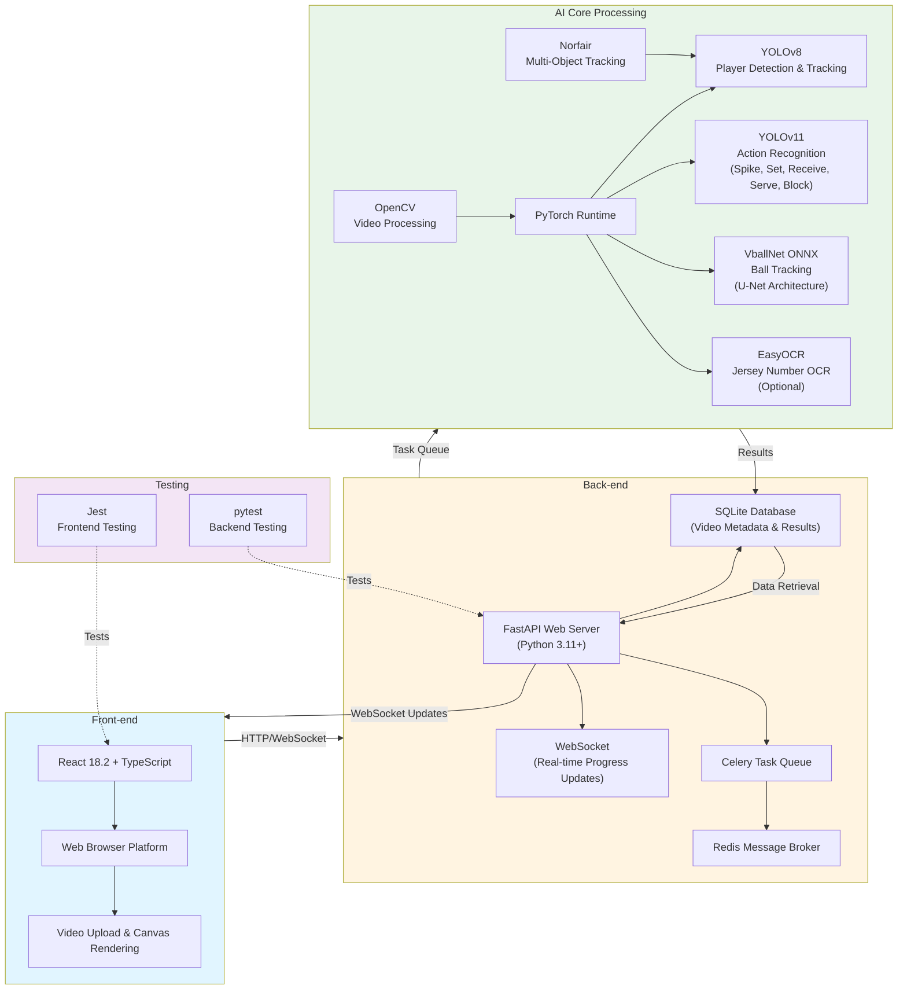

# Volleyball AI Analysis System - Architecture

## System Architecture Diagram

## Component Details

### Front-end Stack
- **React 18.2** - UI framework
- **TypeScript** - Type-safe JavaScript
- **Tailwind CSS** - Utility-first CSS framework
- **Canvas API** - Real-time video rendering and visualizations
- **Axios** - HTTP client for API calls
- **React Router** - Client-side routing
- **Jest** - Testing framework (71.78% coverage)

### Back-end Stack
- **FastAPI** - Modern Python web framework
- **Python 3.11+** - Programming language
- **SQLite** - Lightweight database for video metadata and analysis results
- **Celery** - Distributed task queue for async video processing
- **Redis** - Message broker for Celery
- **WebSocket** - Real-time bidirectional communication
- **pytest** - Python testing framework

### AI/ML Models

#### Player Detection & Tracking
- **Model**: YOLOv8 (Ultralytics)
- **Purpose**: Detect and track players across video frames
- **Confidence Threshold**: ≥50%
- **Tracking**: Norfair multi-object tracking
- **Format**: PyTorch (.pt)

#### Action Recognition
- **Model**: YOLOv11 (Ultralytics)
- **Purpose**: Classify player actions
- **Actions**: Spike, Set, Receive, Serve, Block
- **Confidence Threshold**: ≥60%
- **Format**: PyTorch (.pt)

#### Ball Tracking
- **Model**: VballNet (U-Net architecture)
- **Purpose**: Track ball trajectory in video
- **Input Resolution**: 288×512 pixels (grayscale)
- **Processing Speed**: Up to 200 FPS
- **Performance**: F1-Score: 0.874, Precision: 0.882, Recall: 0.867
- **Format**: ONNX

#### Jersey Number OCR (Optional)
- **Model**: EasyOCR
- **Purpose**: Extract jersey numbers from player bounding boxes
- **Status**: Optional feature

### ML Frameworks & Libraries
- **PyTorch** - Deep learning framework
- **OpenCV** - Computer vision library
- **Norfair** - Multi-object tracking
- **Ultralytics** - YOLO model implementation
- **ONNX Runtime** - ONNX model inference

## Data Flow

1. **Video Upload**
   - User uploads video via React frontend
   - FastAPI receives upload and stores metadata in SQLite
   - Video file saved to disk

2. **Task Queue**
   - FastAPI creates Celery task for video analysis
   - Task queued in Redis
   - Celery worker picks up task

3. **AI Processing**
   - Celery worker loads video using OpenCV
   - YOLOv8 detects and tracks players
   - YOLOv11 recognizes player actions
   - VballNet tracks ball trajectory
   - EasyOCR extracts jersey numbers (optional)
   - Results processed and consolidated

4. **Results Storage**
   - Analysis results stored in SQLite
   - Includes: player tracks, actions, ball trajectory, statistics

5. **Real-time Updates**
   - WebSocket sends progress updates to frontend
   - User sees real-time processing status
   - Results displayed when complete

6. **Visualization**
   - Frontend renders video with Canvas API
   - Overlays bounding boxes, trajectories, heatmaps
   - Interactive timeline for seeking

## Testing Strategy

### Frontend Testing (Jest)
- **Coverage**: 71.78% statements, 61.66% branches
- **Tests**: 257 tests, all passing
- **Components Tested**:
  - VideoPlayer (73.88%)
  - PlayerStats (88.21%)
  - EventTimeline (79.06%)
  - BallTracking (83.87%)
  - PlayerHeatmap (85.33%)
  - BoundingBoxes (68.75%)
  - VideoUpload (59.74%)
  - VideoLibrary (81.7%)
  - PlaySelector (100%)

### Backend Testing (pytest)
- **Framework**: pytest with pytest-cov
- **Coverage**: Backend API endpoints and AI core logic
- **Test Files**:
  - `test_api.py` - API endpoint tests
  - `test_backend.py` - Backend functionality tests
  - `test_integration.py` - Integration tests

## Deployment Architecture

### Development
- Frontend: `npm start` (React dev server on port 3000)
- Backend: `uvicorn main:app --reload` (FastAPI on port 8000)
- Celery: `celery -A worker worker --loglevel=info`
- Redis: Local Redis instance

### Production
- Frontend: Static build deployed to GitHub Pages
- Backend: FastAPI with Uvicorn ASGI server
- Celery: Production worker with Redis broker
- Database: SQLite (can be migrated to PostgreSQL)

## Technology Stack Summary

| Category | Technology |
|----------|-----------|
| **Frontend Framework** | React 18.2 |
| **Language** | TypeScript |
| **Styling** | Tailwind CSS |
| **Backend Framework** | FastAPI |
| **Backend Language** | Python 3.11+ |
| **Database** | SQLite |
| **Task Queue** | Celery |
| **Message Broker** | Redis |
| **Real-time Communication** | WebSocket |
| **Player Detection** | YOLOv8 + Norfair |
| **Action Recognition** | YOLOv11 |
| **Ball Tracking** | VballNet (ONNX) |
| **OCR** | EasyOCR (optional) |
| **ML Framework** | PyTorch |
| **Computer Vision** | OpenCV |
| **Frontend Testing** | Jest |
| **Backend Testing** | pytest |

## Performance Metrics

- **Ball Tracking**: Up to 200 FPS on Intel Core i5-10400F CPU
- **Model Performance**:
  - Ball Tracking F1-Score: 0.874
  - Action Recognition Confidence: ≥60%
  - Player Detection Confidence: ≥50%
- **Test Coverage**: 71.78% frontend, comprehensive backend tests
- **Video Support**: Up to 2GB file size

## Security Considerations

- Environment variables for sensitive configuration
- SQLite database file permissions
- File upload validation and size limits
- CORS configuration for API endpoints
- Input validation on all API endpoints

